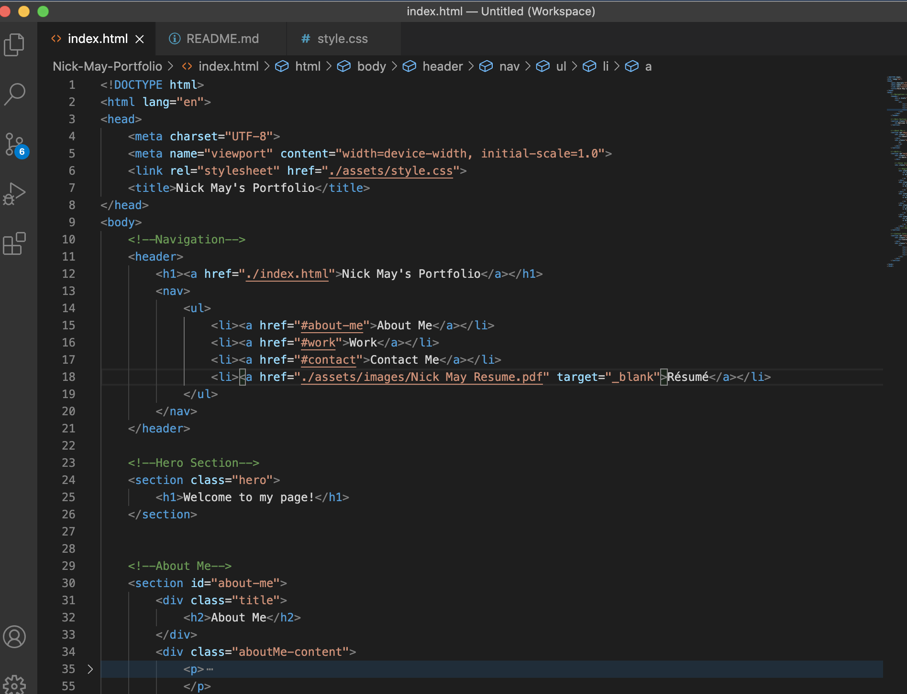
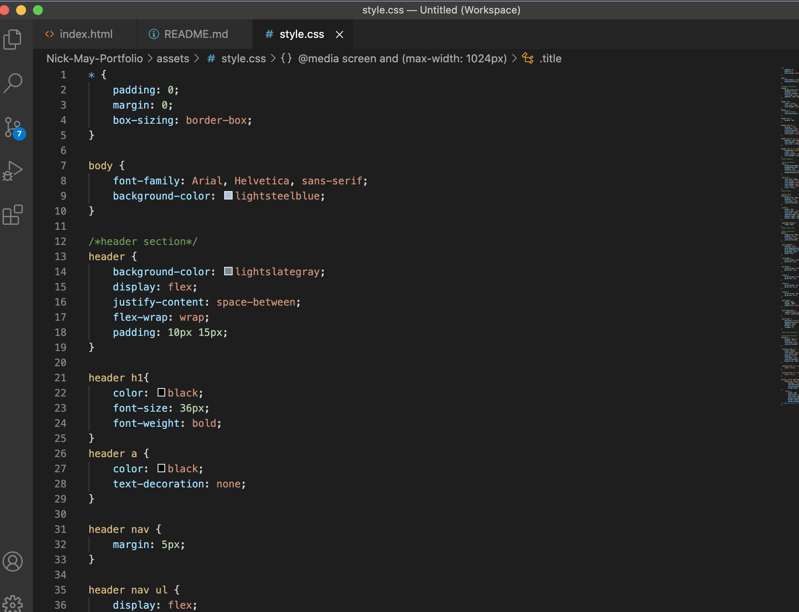

# Nick-May-Portfolio

## Description
This is UCF Coding Boot Camp Challenge 2. Created the first draft of my portfolio using HTML and CSS.

## Screenshots

## Project Link
[Click here to go to GitHub project link.](https://nickmay9.github.io/Nick-May-Portfolio/) Or if you want to copy and paste, here is the link: https://nickmay9.github.io/Nick-May-Portfolio/